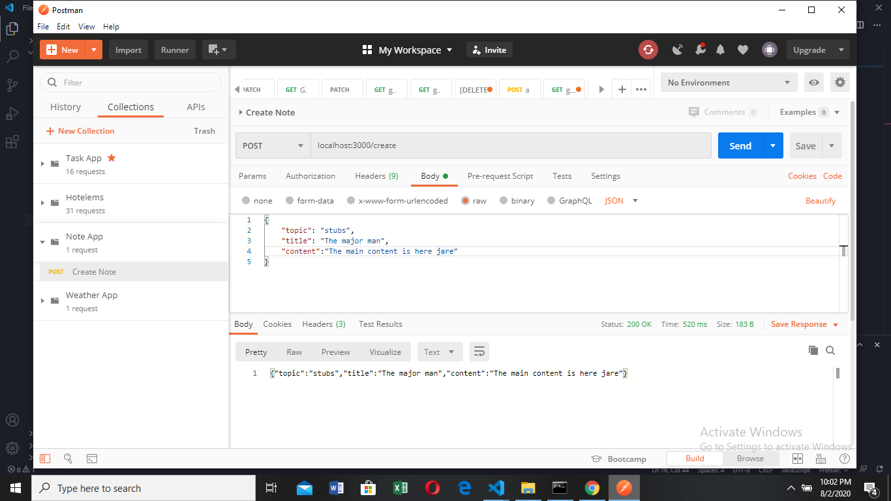
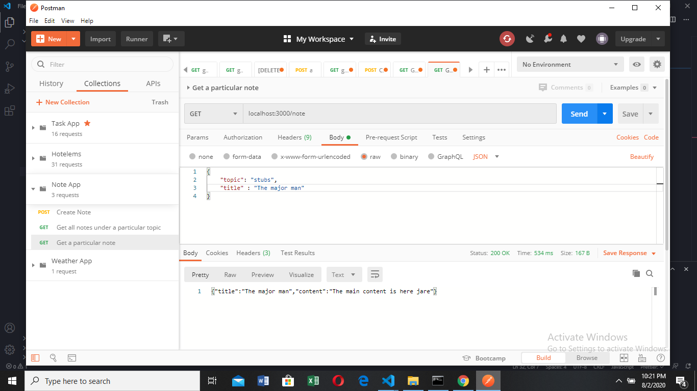
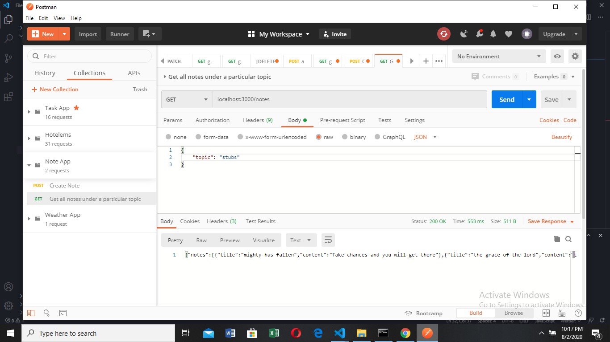

# Note App

Simple note application using http module and fs module

## npm start

Starts the server locally on port 3000

## Screenshots from POSTMAN

- CREATE NOTE
  

- GET A NOTE BY ITS TOPIC AND TITLE
  

- GET ALL NOTES UNDER A TOPIC
  
